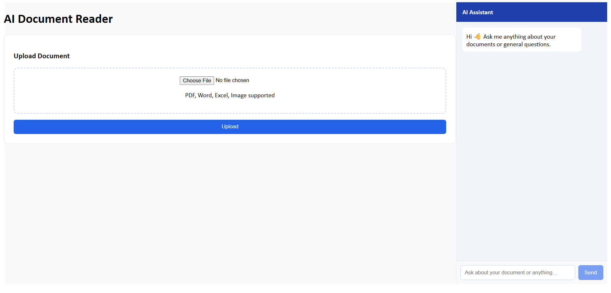
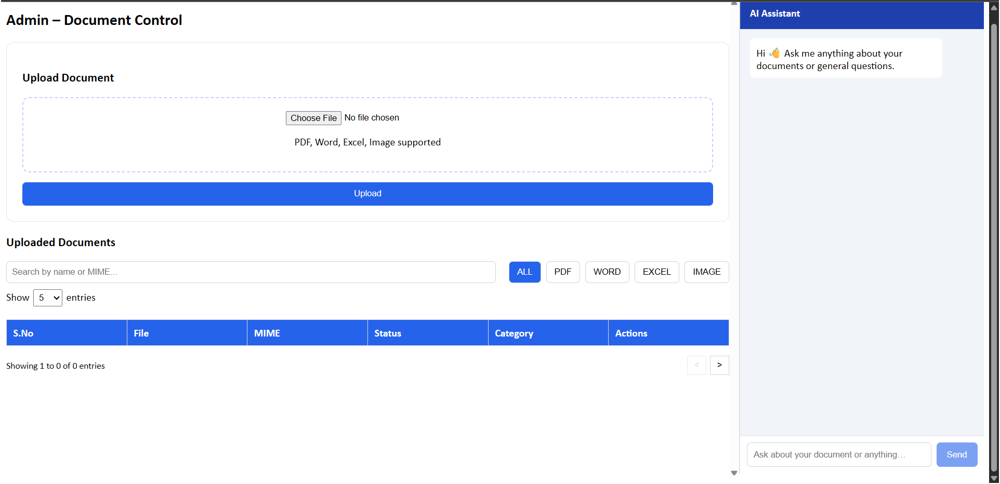
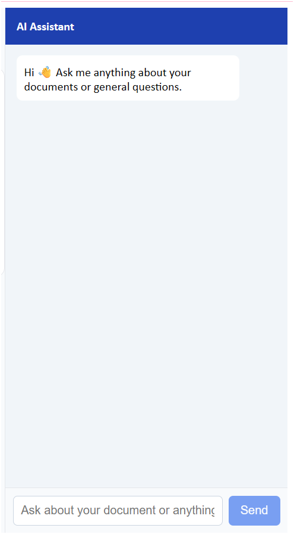

# AI Module for Documentation

AI-powered document management and analysis system with semantic search, document upload, viewing, editing and AI assistant support.

---

## Features

- Upload PDF, Word, Excel and Image files
- Document viewing and editing
- Admin dashboard
- User dashboard
- AI Chat Assistant
- Semantic search
- Embedding support
- Analytics module
- Document categorization

---

## Tech Stack

### Frontend
- React
- Vite
- CSS

### Backend
- Node.js
- Express.js

### AI Layer
- LLaMA (LLM)
- Embeddings
- Semantic Search
- NLP Processing

---

# Running Project

## Backend

```bash
cd backend
npm install
npm start
```

Backend runs on:

```text
http://localhost:5000
```

---

## Frontend

```bash
cd frontend
npm install
npm run dev
```

Frontend:

```text
http://localhost:5173
```

---

# Running LLaMA Server (Required for AI Chat)

Install Ollama:

Windows:

https://ollama.com/download

Check installation:

```bash
ollama --version
```

Pull LLaMA model:

```bash
ollama pull llama3
```

Start model:

```bash
ollama run llama3
```

Keep terminal running.

Default endpoint:

```text
http://localhost:11434
```

AI assistant uses LLaMA for:

- Question answering
- Document understanding
- Semantic responses
- Context retrieval
- Chat support

---

# Screenshots

## User Dashboard



Features:

- Upload documents
- AI assistant
- File support
- User interaction

---

## Admin Dashboard



Features:

- Document management
- Filters
- View / Edit support
- Category control

---

## AI Chat



LLaMA powered assistant for:

- Document Q&A
- Summaries
- Search
- Context understanding

---

# Future Enhancements

- OCR extraction
- Authentication
- Role management
- Export reports
- Notifications
- AI summarization

---

Author:

Sruthi  
ECE Engineer